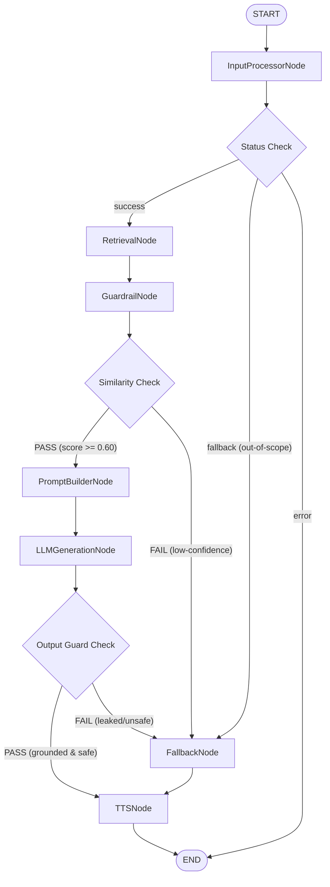

# HHGOA-2026: Multilingual RAG Voice Generator

An enterprise-grade, secure, multilingual Retrieval-Augmented Generation (RAG) system with integrated Text-to-Speech (TTS) voice generation, orchestrated cleanly using LangGraph.

---

## 1. LangGraph Architecture

The orchestration logic is built as a stateful graph where each node represents a thin wrapper around highly decoupled underlying engines (such as Qdrant, Sarvam LLM, and Sarvam TTS).

### Graph Flow



---

## 2. Graph Nodes & Responsibilities

1. **`InputProcessorNode`**: Validates user inputs (type check, query length, and prompt injection signatures) using the `InputValidator`. Verifies that queries fall within functional parameters (disallowing code writing, real-time sensor request limits, etc.) using `QueryGuard`. Maps requested languages.
2. **`RetrievalNode`**: Encodes queries into 1024-dimensional dense vectors using the `BAAI/bge-m3` model and searches the local persistent `tamil_rag_chunks` collection on Qdrant.
3. **`GuardrailNode`**: Implements **Layer 3 Guardrails** (filtering similarity scores below `0.60`) and **Layer 4 Guardrails** (short-circuiting zero-evidence outcomes) using the `RetrievalGuard`.
4. **`PromptBuilderNode`**: Formulates XML context-isolated templates, maintaining rigid boundaries to treat retrieved context strictly as data instead of instruction overrides.
5. **`LLMGenerationNode`**: Sends grounded prompts to the `sarvam-105b` LLM wrapper and runs post-generation validation checks using the `OutputGuard` (blocking system prompt leakage or unsafe content).
6. **`FallbackNode`**: Handles missing context, out-of-scope questions, and model failures, loading pre-translated, safe default responses in English, Tamil, Telugu, and Hindi.
7. **`TTSNode`**: Invokes the `TTSEngine` (Sarvam Bulbul v3 API wrapper) to synthesize output answer texts into cacheable `.wav` speech audio files.

---

## 3. Graph State (`RAGGraphState`)

The state manages the complete request lifecycle:
```python
from typing import TypedDict, List, Dict, Any, Optional

class RAGGraphState(TypedDict):
    query: str
    language: str
    retrieved_chunks: List[Dict[str, Any]]
    retrieval_scores: List[float]
    retrieval_passed: bool
    prompt: Optional[Any]
    answer: Optional[str]
    answer_valid: bool
    audio_path: Optional[str]
    sources: List[Dict[str, Any]]
    error: Optional[str]
    status: str  # "success" | "fallback" | "error"
```

---

## 4. How to Execute

Initialize and invoke the graph programmatically:

```python
from graph.workflow import build_rag_graph

# 1. Compile the graph
graph = build_rag_graph()

# 2. Invoke the workflow
state = graph.invoke({
    "query": "ஒரு நிறுவனம் என்பது என்ன?",
    "language": "tamil"
})

# 3. Access output audio file and text response
print("Answer:", state["answer"])
print("Audio WAV path:", state["audio_path"])
print("Retrieved Sources:", state["sources"])
```

---

## 5. Verification & Tests

A comprehensive integration test suite is provided to verify state transitions and conditional routing.

### Run Integration Tests
```powershell
& .venv/Scripts/python scripts/test_graph.py
```
This executes 9 scenarios:
* **T1–T4**: English, Tamil, Telugu, Hindi successes.
* **T5**: Low-confidence query (asserts LLM bypass, routes `Retrieval ➔ Guard FAIL ➔ Fallback ➔ TTS`).
* **T6**: Empty query validation rejection (routes `Input ➔ END`).
* **T7**: Prompt injection isolation in chunks (asserts safe grounding).
* **T8**: Simulated LLM connection failures (asserts graceful fallback).
* **T9**: Simulated TTS API timeout crashes (asserts graph runs to completion, returning text answers).

### Run Standing Regression Suites
To verify that standalone pipeline wrappers remain backward-compatible, run:
```powershell
& .venv/Scripts/python scripts/test_pipeline_voice.py
& .venv/Scripts/python scripts/evaluate_rag.py
```

---

## 6. FastAPI HTTP Backend

A production-ready FastAPI backend wraps the stateful LangGraph workflow, exposing query processing and safe audio streaming endpoints.

### Start the Backend Server
Run the following command to spin up the local development server:
```powershell
& .venv/Scripts/python -m uvicorn backend.main:app --reload --host 127.0.0.1 --port 8000
```
Once started:
* Interactive Swagger Docs: [http://127.0.0.1:8000/docs](http://127.0.0.1:8000/docs)
* Redoc Documentation: [http://127.0.0.1:8000/redoc](http://127.0.0.1:8000/redoc)

### Configuration Layer (`.env`)
The backend parses environment settings:
* `SARVAM_API_KEY`: API authorization key.
* `CORS_ORIGINS`: Comma-separated list of allowed origins (e.g. `http://localhost:3000`).
* `AUDIO_DIR`: Path to output WAV files (default: `data/audio_responses`).

### API Endpoints

#### 1. Liveness Check (`GET /health`)
Lightweight route verifying API server status. Returns `{"status": "ok"}`.

#### 2. Readiness Check (`GET /health/ready`)
Verifies connection to the local Qdrant collection database instantly, without loading heavy embedding models. Returns:
```json
{
  "status": "ready",
  "qdrant": "ok",
  "graph": "ok"
}
```

#### 3. RAG Query Endpoint (`POST /api/v1/rag/query`)
Processes queries through the state graph.
* **Request Schema (`RAGRequest`)**:
  ```json
  {
    "query": "ஒரு நிறுவனம் என்பது என்ன?",
    "language": "tamil"
  }
  ```
* **Response Schema (`RAGResponse`)**:
  ```json
  {
    "status": "success",
    "query": "ஒரு நிறுவனம் என்பது என்ன?",
    "language": "tamil",
    "answer": "ஒரு நிறுவனம் என்பது ஒரு நபராக...",
    "sources": [
      {
        "chunk_id": "1102432_p4_c0",
        "score": 0.6496,
        "language": "tam_Taml",
        "text": null
      }
    ],
    "audio_url": "/api/v1/audio/response_3930395072164026023_tamil.wav",
    "error": null
  }
  ```

#### 4. Safe Audio Streaming (`GET /api/v1/audio/{audio_filename}`)
Serves generated speech output. Implements strict regex sanitization checking `^response_\d+_[a-z]+\.wav$` on request filenames to completely block path traversal vulnerabilities. Returns the audio stream with `audio/wav` header encoding.

### Run Backend API Test Suite
Execute the following verification script to test client liveness, validations, fallback states, security routing, and run a live HTTP Uvicorn integration loop:
```powershell
& .venv/Scripts/python scripts/test_backend.py
```

---

## 7. How to Run the Project

Follow these steps to run both the FastAPI backend and Next.js frontend locally.

### Prerequisites
* **Python 3.10+** (venv is configured under `.venv`)
* **Node.js 18+** & **npm**

### Step 1: Run the Backend API Server
1. Verify that your API credentials exist inside the `.env` file in the project root:
   ```env
   SARVAM_API_KEY=your_sarvam_api_subscription_key
   CORS_ORIGINS=http://localhost:3000
   ```
2. Open a terminal and start the Uvicorn server:
   ```powershell
   & .venv/Scripts/python -m uvicorn backend.main:app --reload --host 127.0.0.1 --port 8000
   ```
   *The backend will load the local Qdrant collection from `data/qdrant_db` and listen for HTTP requests.*

### Step 2: Run the Next.js Frontend
1. Open a new terminal window.
2. Navigate to the `frontend` folder:
   ```powershell
   cd frontend
   ```
3. Install Node package dependencies:
   ```powershell
   npm install
   ```
4. Verify that `frontend/.env.local` targets the correct backend host:
   ```env
   NEXT_PUBLIC_API_URL=http://localhost:8000
   ```
5. Run the dev server:
   ```powershell
   npm run dev
   ```
   *Or build and start the optimized production bundle (Recommended):*
   ```powershell
   npm run build
   npm run start
   ```

### Step 3: Accessing the Application
* **Next.js UI Dashboard**: [http://localhost:3000](http://localhost:3000)
* **FastAPI Backend Liveness**: [http://localhost:8000/health](http://localhost:8000/health)
* **Interactive API Swagger Docs**: [http://localhost:8000/docs](http://localhost:8000/docs)

### Running Verification Tests
Execute these scripts within the virtual environment to run regression and API checks:
```powershell
# 1. State Graph routes & safety validation checks
& .venv/Scripts/python scripts/test_graph.py

# 2. FastAPI route checks & E2E HTTP subprocess test
& .venv/Scripts/python scripts/test_backend.py

# 3. Pipeline audio synthesis and retrieval check
& .venv/Scripts/python scripts/test_pipeline_voice.py

# 4. RAG system refusal and accuracy evaluation reports
& .venv/Scripts/python scripts/evaluate_rag.py
```

